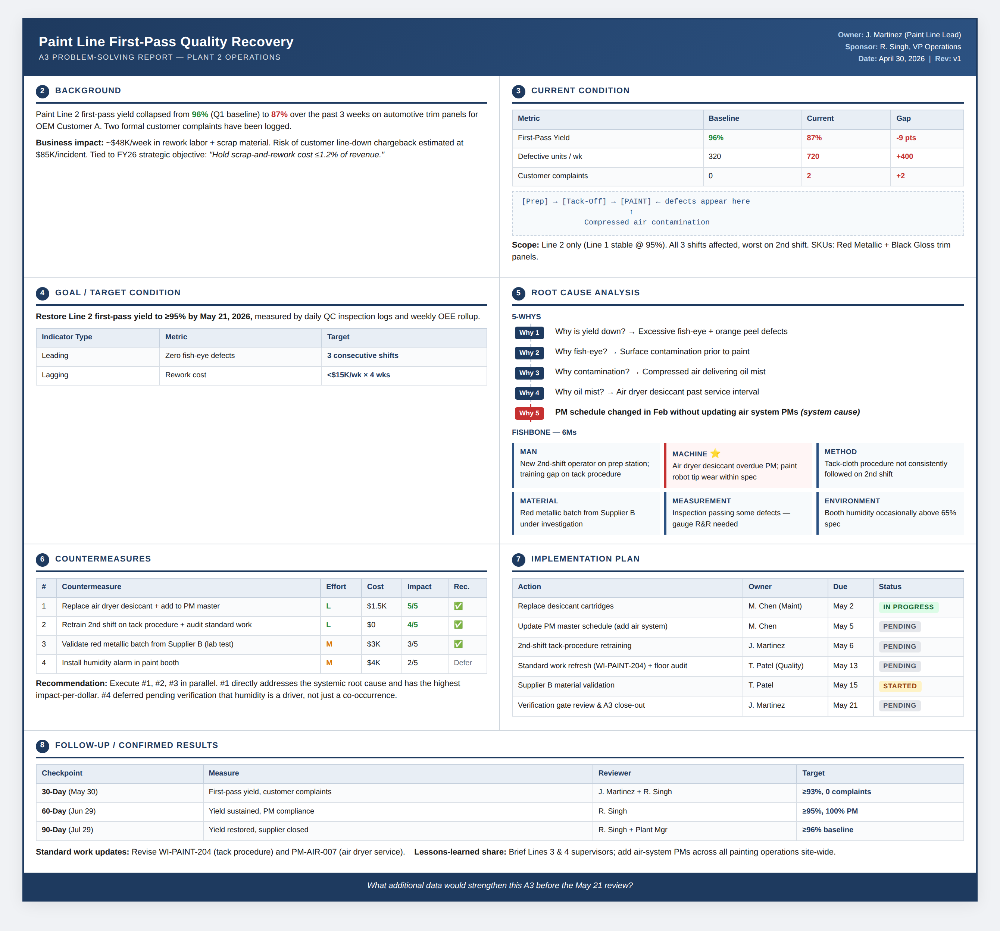

# Manufacturing Ops Skills for Claude

> AI skills built **by** a manufacturing operations director, **for** manufacturing operations directors. No coding required. Free forever.

Most "AI skills" repos are built by software engineers for software engineers. This one is different — it's built for the people who run production lines, manage quality systems, and lead daily tier meetings.

## 🚀 Quick Start (3 minutes, no coding)

1. **Download** this repo as a ZIP (green **Code** button → **Download ZIP**)
2. Open **Claude.ai** → **Settings** → **Customize** → **Skills** → **+ Create Skill**
3. Upload the folder for the skill you want (e.g., `a3-problem-solver`)
4. Start a new chat and ask Claude to run an A3 on any problem

That's it. Claude will auto-invoke the skill when relevant.

## 📋 Skills in This Library

| Skill | What It Does | Status |
|---|---|---|
| **a3-problem-solver** | Toyota-style A3 reports with 5-Whys + fishbone | ✅ Live |
| 8d-report-builder | Automotive 8 Disciplines (D1–D8) problem solving | 🔜 Coming this week |
| pfmea-generator | Process FMEA with Severity / Occurrence / Detection / RPN scoring | 🔜 Coming this week |
| oee-diagnostic | Availability × Performance × Quality breakdown with loss buckets | 🔜 Coming this week |
| tier-meeting-coach | Daily tier 1/2/3 huddle agendas from yesterday's KPIs | 🔜 Coming this week |

⭐ **Star this repo** to follow along as new skills drop.

## 🎯 Example: A3 Problem Solver in Action

**Input prompt:**
> "Run an A3 on our paint line. First-pass quality dropped from 96% to 87% over the last 3 weeks. Two customer complaints from OEM Customer A. We're shipping 8,000 units/week of automotive trim panels."

**Output:** A complete single-page A3 with:
- Background tied to financial impact and strategic objectives
- Current condition data table with gap analysis
- SMART goal with leading + lagging indicators
- 5-Whys ending at a system cause (not "operator error")
- Fishbone diagram across all 6Ms
- 4 ranked countermeasures with effort/cost/impact/risk
- Implementation Gantt with single owners and hard dates
- 30/60/90 follow-up checkpoints

Generated in under 15 seconds. See the [full sample output](./sample-a3-paint-line.png) above.

## 🤔 Why I Built This

I'm a manufacturing operations director. My team runs A3s, FMEAs, and tier meetings every week. AI tools are flooding the market — but none of them speak our language.

So I started building skills that do.

If you run a plant, manage a quality system, or lead lean projects, star this repo and follow along. New skills drop weekly.

Find me on [LinkedIn](https://www.linkedin.com/in/manoj-surapaneni)

## 📜 License

MIT — use it, fork it, ship it. Attribution appreciated but not required.

## 🛠️ Contributing

Got an operations workflow you'd love to see as an AI skill? [Open an issue](../../issues) and tell me about it. The next 4 skills are already mapped — but if there's something a plant manager would actually use every day, I want to hear it.

---

**Built for the floor, not the framework.**
